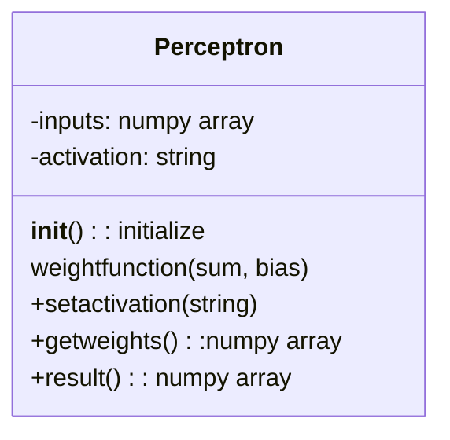

```mermaid

classDiagram
    class Perceptron{
     -inputs: numpy array
     -activation: string 
     __init__(): initialize
    weightfunction(sum, bias)
     +setactivation(string)
     +getweights():numpy array
     +result(): numpy array
     }
```